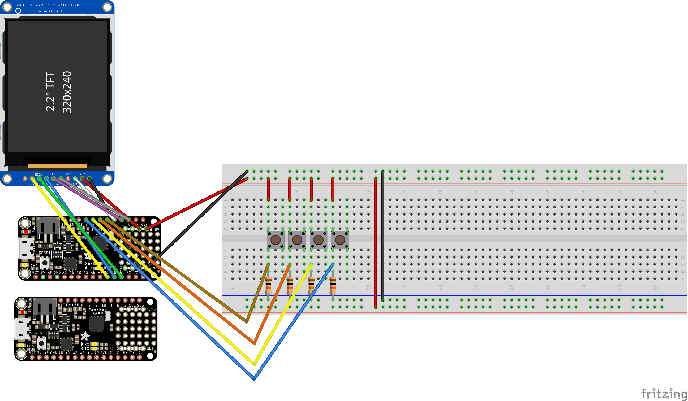
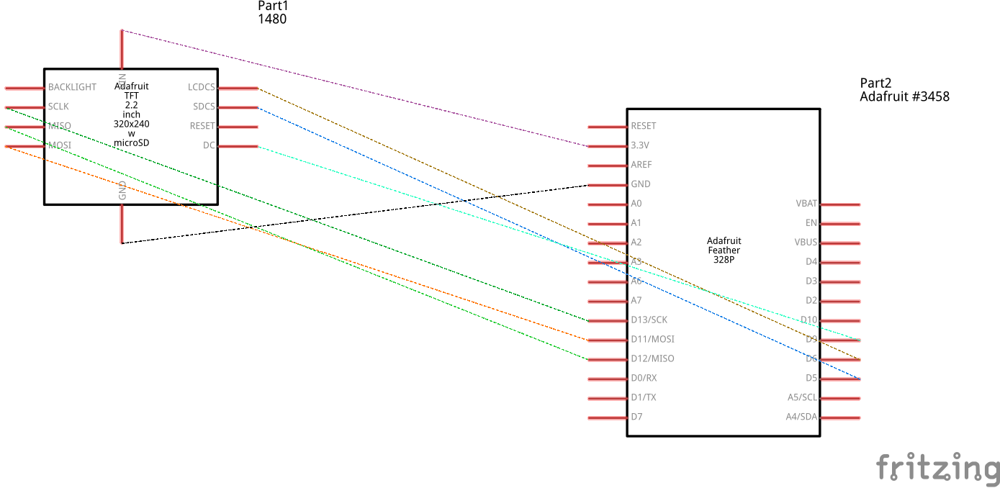

# WalkingStickPrompter

A walking stick tele-prompter.

## Usage

With the 

### SD Card

The SD card has several "gotcha's":

- Must be formatted as FAT
- Directories currently not supported; TODO in the future to support
- Keep the SD relatively clean, not too many files. For file selection need all the file names read in and there isn't a ton or RAM to go around!
- File names:
  - can only be 8 characters long, or will be shortened artificially in the display. Unfortunately, with the tech used there isn't a way around this.
  - sometimes a file can get weird, and fail to read. try renaming it.

Resources:

- https://www.arduino.cc/en/Reference/SDCardNotes
- 

## Build Documentation

### Bill of Materials

- [Adafruit Feather 328P](https://learn.adafruit.com/adafruit-feather-328p-atmega328-atmega328p/overview)
- [2.2" 18-bit color TFT LCD display with microSD card breakout](https://www.adafruit.com/product/1480)

### Resources

- [Adafruit Feather 328P Pinouts](https://learn.adafruit.com/adafruit-feather-328p-atmega328-atmega328p/pinouts)
- [Adafruit 2.2" TFT Display with SD Card Reader](https://learn.adafruit.com/2-2-tft-display)
- [Adafruit ILI9341 Arduino Library](https://github.com/adafruit/Adafruit_ILI9341)
- [Adafruit TFT Display Example](https://github.com/adafruit/Adafruit_ILI9341/blob/master/examples/graphicstest/graphicstest.ino)
- [Adafruit Graphics Primitives](https://learn.adafruit.com/adafruit-gfx-graphics-library/graphics-primitives)
- Adafruit SD examples in the IDE
- https://cpp4arduino.com/2020/02/07/how-to-format-strings-without-the-string-class.html

### Environment Setup

1. Arduino IDE Setup
   1. Board Selection
      - Board: `Arduino Pro or Arduino Pro Mini`
      - Processor: `ATMega328P (3.3V, 8 MHz)`
   2. Required Libs
      - [Adafruit BusIO Library](https://github.com/adafruit/Adafruit_BusIO)
      - [AdaFruit GFX Library](https://github.com/adafruit/Adafruit-GFX-Library)
      - [Adafruit ILI9341 Library](https://github.com/adafruit/Adafruit_ILI9341)
      - [LinkedList](https://github.com/ivanseidel/LinkedList)
        - I needed to delete the `test.cpp` file in the library's directory for it to work.

### Circuitry

Realistic circuit diagram:

Schematic view:

### Additional

#### Fritzing

Requires the addition of the Adafruit resource pack:

https://learn.adafruit.com/using-the-adafruit-library-with-fritzing/import-the-library-into-fritzing

## Future TODOs:

- Support directories
- backlight control
- Save settings to the SD card

