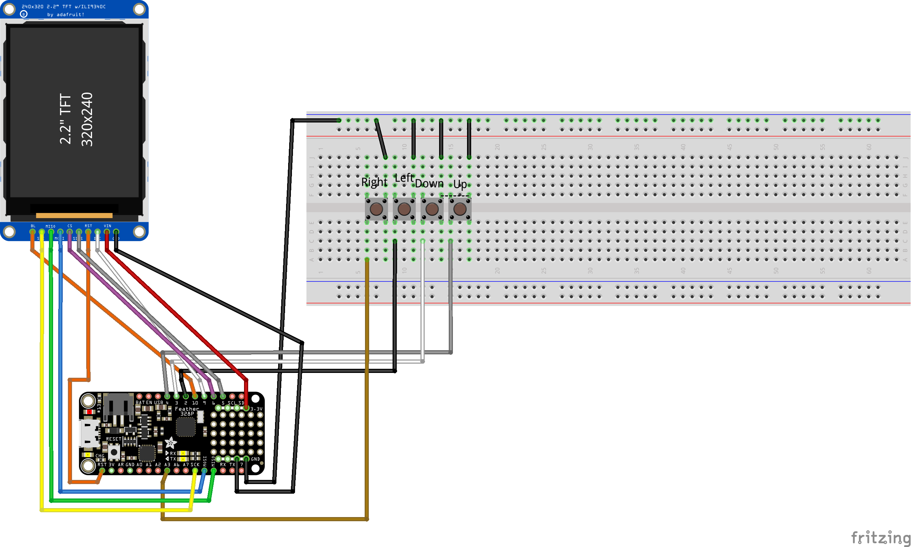
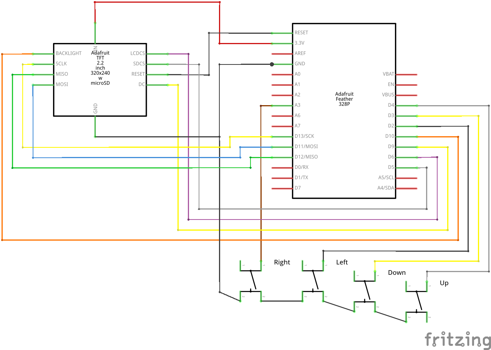

# WalkingStickPrompter

A walking stick tele-prompter.

## Usage

### SD Card

The SD card has several "gotcha's":

- Must be formatted as `FAT` (preferably `FAT16`, but `FAT32` should work as well) 
- Directories currently not supported
- Keep the SD relatively clean, not too many files. For file selection need all the file names read in and there isn't a ton or RAM to go around!
  - One shouldn't have more than 13 `.txt` files available, as the menu system doesn't currently support scrolling

Resources:

- https://www.arduino.cc/en/Reference/SDCardNotes

### Files

These are guidelines for files that are on the sd card. For the device to operate properly, you must keep these things in mind.

- File names:
  - Case insensitive; `hello.txt` will be seen the same as `Hello.txt` and the board will get confused.
  - can only be 8 characters long, or will be shortened artificially in the display. Unfortunately, with the tech used there isn't a way around this.
  - sometimes a file can get weird, and fail to read. try renaming it.
- File Formats:
  - Currently, only `.txt` files are accepted.
  - The files must be pre-formatted before they will display correctly
    - Essentially, newlines will mess up how the text is displayed on the screen, moving all text under the newline down (and out of view)
    - There is a tool though for formatting the files appropriately: [Formatter](Formatter.html)
- The device will save the options set by the user to the SD card using the `OPS.DAT` file. This is not meant to be edited manually, but can be deleted to reset the options to default.

Resources:

- https://www.arduino.cc/en/Reference/SDCardNotes

### Battery

On preliminary measurements, will full brightness and smallest text size, the device lasted ____ on a 1200mAh battery.

To charge the battery, simply plug the main board into the computer or phone charger, with the battery plugged in and on (if a switch was added between the battery and the board). The main board will handle charging the battery.

The Orange light on the board is an indicator for charging status:

- Off = Not charging, fully charged
- On = Charging
- Flashing = No battery connected

More information here: https://learn.adafruit.com/adafruit-feather-328p-atmega328-atmega328p/power-management

### How to Use

The board uses a simple menu system to navigate. When the device is powered on, it first displays a splash screen. After that, it will go into the file select menu.

#### File Selection

This menu shows all valid and available text files for reading.

Use <kbd>Up</kbd> or <kbd>Down</kbd> to highlight a file, <kbd>Right</kbd> to select it (moving into file reading).

Pressing <kbd>Left</kbd> will send you to the Options Menu

#### File Reading

When reading a file, it will simply display one page of file content at a time.

- <kbd>Down</kbd> will load the next page

- <kbd>Up</kbd> will load the previous page
- <kbd>Left</kbd> will send you back to File Selection

#### Options Menu

The Options menu will let you change the presentation of text when reading files in.

Use <kbd>Up</kbd> or <kbd>Down</kbd> to highlight an option to change, <kbd>Right</kbd> to select it (moving to that option's specific menu).

Pressing <kbd>Left</kbd> will send you back to File Select.

##### Text Size

The text size menu will change the size of the text when file reading.

Use <kbd>Up</kbd> or <kbd>Down</kbd> to cycle through the available sizes, <kbd>Right</kbd> to set the size to the current one shown.

Pressing <kbd>Left</kbd> will send you back to the Options menu without saving changes.

##### Text Color

The text size menu will change the color of the text when file reading.

Use <kbd>Up</kbd> or <kbd>Down</kbd> to hilight the available colors, <kbd>Right</kbd> to set the color to the current one selected.

Pressing <kbd>Left</kbd> will send you back to the Options menu without saving changes.

##### Backlight

The text size menu will change the backlight level of the screen.

Use <kbd>Up</kbd> or <kbd>Down</kbd> to cycle through the available brightnesses, <kbd>Right</kbd> to set the brightness to the current one shown.

Pressing <kbd>Left</kbd> will send you back to the Options menu without saving changes.

## Build Documentation

### Bill of Materials

- [Adafruit Feather 328P](https://learn.adafruit.com/adafruit-feather-328p-atmega328-atmega328p/overview)
- [2.2" 18-bit color TFT LCD display with microSD card breakout](https://www.adafruit.com/product/1480)
- 4 momentary switches, or a d-pad
- 1 snap switch for battery (optional)

### Resources

- [Adafruit Feather 328P Pinouts](https://learn.adafruit.com/adafruit-feather-328p-atmega328-atmega328p/pinouts)
- [Adafruit 2.2" TFT Display with SD Card Reader](https://learn.adafruit.com/2-2-tft-display)
  - https://learn.adafruit.com/2-2-tft-display/adafruit-gfx-library
  - 
- [Adafruit ILI9341 Arduino Library](https://github.com/adafruit/Adafruit_ILI9341)
  - https://github.com/adafruit/Adafruit_ILI9341/blob/master/Adafruit_ILI9341.h
  - 
  - https://learn.adafruit.com/adafruit-gfx-graphics-library/overview
  - https://learn.adafruit.com/adafruit-gfx-graphics-library?view=all
  - https://www.arduino.cc/en/Reference/TFTSetTextSize
- [Arduino SD Library](https://github.com/arduino-libraries/SD)
  - https://github.com/arduino-libraries/SD/blob/master/src/utility/SdFile.cpp
  - https://github.com/arduino-libraries/SD/blob/master/src/File.cpp
  - https://github.com/adafruit/SD/blob/master/examples/Files/Files.ino
  - https://www.arduino.cc/en/Reference/SD
    - https://www.arduino.cc/en/Reference/FileRead
    - https://www.arduino.cc/en/Reference/FileSeek
- [Arduino Data Types](https://www.tutorialspoint.com/arduino/arduino_data_types.htm)
- [Adafruit TFT Display Example](https://github.com/adafruit/Adafruit_ILI9341/blob/master/examples/graphicstest/graphicstest.ino)
- [Adafruit Graphics Primitives](https://learn.adafruit.com/adafruit-gfx-graphics-library/graphics-primitives)
- Adafruit SD examples in the IDE
- https://learn.adafruit.com/adafruit-micro-sd-breakout-board-card-tutorial/arduino-library
- https://www.arduino.cc/reference/en/language/functions/communication/serial/print/
- https://create.arduino.cc/projecthub/muhammad-aqib/arduino-button-tutorial-using-arduino-digitalread-function-08adb5
- https://forum.arduino.cc/t/passingpassing-f-string-as-a-parameter/108984
- https://cpp4arduino.com/2020/02/07/how-to-format-strings-without-the-string-class.html
- https://www.geeksforgeeks.org/readwrite-class-objects-fromto-file-c/
- https://www.arduino.cc/reference/en/language/variables/data-types/stringobject/
- My Forum posts:
  - https://forum.arduino.cc/t/f-macro-garbled-c-string/896971
  - https://forums.adafruit.com/viewtopic.php?f=57&t=182150&p=885279#p885279
  - https://forums.adafruit.com/viewtopic.php?f=47&t=182033&p=885513#p885513
  - https://electronics.stackexchange.com/questions/580450/correct-wiring-for-adafruit-2-2-tft-display-w-sd-card?noredirect=1#comment1519294_580450

### Environment Setup

1. Arduino IDE Setup
   1. Board Selection
      - Board: `Arduino Pro or Arduino Pro Mini`
      - Processor: `ATMega328P (3.3V, 8 MHz)`
   2. Required Libs
      - [Adafruit BusIO Library](https://github.com/adafruit/Adafruit_BusIO)
      - [AdaFruit GFX Library](https://github.com/adafruit/Adafruit-GFX-Library)
      - [Adafruit ILI9341 Library](https://github.com/adafruit/Adafruit_ILI9341)
      - [LinkedList](https://github.com/ivanseidel/LinkedList)
        - I needed to delete the `test.cpp` file in the library's directory for it to work.

### Circuitry

Realistic circuit diagram:

Schematic view:

### Additional

#### Fritzing

Requires the addition of the Adafruit resource pack:

https://learn.adafruit.com/using-the-adafruit-library-with-fritzing/import-the-library-into-fritzing

## Future TODOs:

- Support directories
- Show images on the TFT (requires different microcontroller board with more program space/ RAM!)
- Menu code support scrolling
- Support measuring battery: https://learn.adafruit.com/adafruit-feather-328p-atmega328-atmega328p/power-management
- Have a status screen during reading mode, show battery and progress stats. Navigation aides?

